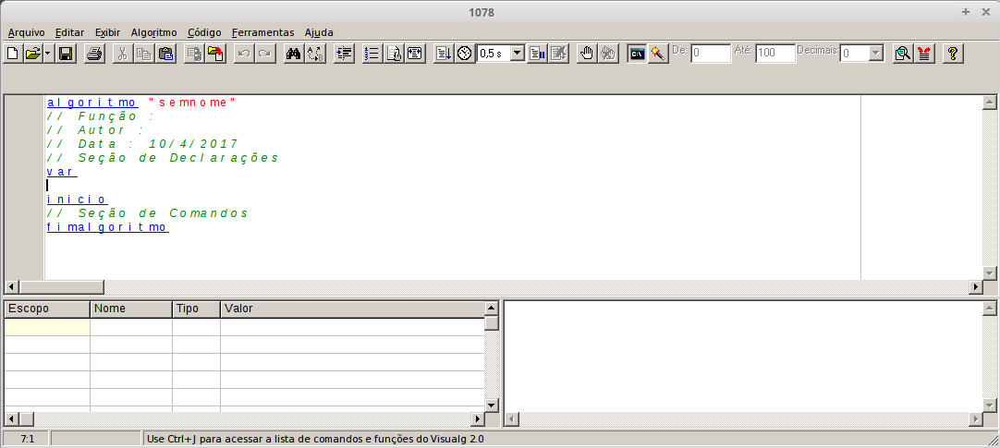
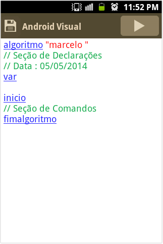

## Sobre
Teoria, exemplos e exercícios sobre os fundamentos da lógica de programação.

## Infraestrutura
Para estudar lógica de programação é necessário ter um software que interprete e execute comandos do pseudocódigo. Um dos diversos softwares existentes para interpretação e execução de comandos do pseudocódigo é o **VisualG**. Este software é gratuito e é desenvolvido por uma empresa brasileira chamada **Apoio Informática**.

A seguir estão os procedimentos para montar a infraestrutura nos sistemas operacionais Windows, Linux e Android.

### Sistema Operacional Windows
* Baixar o VisualG
* Salvar o arquivo visualg2.0.exe num diretório de sua preferência
* Abrir o Windows Explorer
* Entrar no diretório onde o arquivo visualg2.0.exe foi salvo
* Executar o VisualG clicando duas vezes sobre o arquivo visualg2.0.exe
* A figura abaixo é a tela inicial do VisualG no Windows.

### Sistema Operacional Linux

* Instalar o Wine
* Baixar o VisualG
* Salvar o arquivo visualg2.0.exe num diretório de sua preferência
* Abrir um Terminal
* Entrar no diretório onde o arquivo visualg2.0.exe foi salvo
* Executar o VisualG utilizando o comando wine visualg2.0.exe
* A figura abaixo é a tela inicial do VisualG no Linux.

### Sistema Operacional Android
* Baixar o AndroidVisual na PlayStore
* Executar o AndroidVisual

A figura abaixo é a tela inicial do AndroidVisual.

